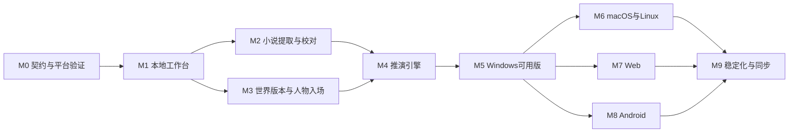

# 叙演工坊：开发路线与验收标准

版本：0.2-draft · 日期：2026-09-18  
状态：计划与验收定义，全部实施任务尚未开始。只有实际测试通过后才能标记完成。

## 1. 开发目标与交付顺序

先交付Windows上的完整创作闭环：导入资料 → 校对与编辑 → 人物适配入场 → 指定时间和事件 → 多模型推演 → 暂停/分支/比较 → 导出。

从第一阶段就验证跨平台关键依赖，Windows功能闭环之后再逐个平台完善发行体验。仅能编译不等于平台已交付；每个平台都要通过文件、凭据、网络、生命周期和核心流程验收。

本版采用C++20、Qt Quick与CMake。M0中先贯通一个无真实API依赖的小样例，证明存储和推演架构可行；完整小说提取和多提供商功能仍按M2—M5交付。工程验证样例不称为产品MVP，避免缩小原始需求。

版本建议：

| 版本 | 里程碑 | 用户可获得的能力 |
|---|---|---|
| 0.0.x | M0—M1 | 工程验证与本地资料工作台 |
| 0.1-alpha | M2—M3 | 小说提取、世界版本、人物投放与基础视图 |
| 0.2-alpha | M4 | 可恢复的多模型剧情推演 |
| 0.3-beta | M5 | Windows完整闭环与分支比较、导出、可靠性 |
| 0.4 | M6 | macOS/Linux可用发行版 |
| 0.5 | M7 | 可用Web版本，优先单用户自托管 |
| 0.6 | M8 | Android适配版 |
| 1.0候选 | M9 | 跨平台稳定性、必要同步与用户反馈收敛 |

版本号可调整，功能与验收边界比编号更重要。云同步不是桌面各平台能独立运行的前置条件。

## 2. 任务依赖

M2和M3在多人团队中可并行，但单人开发可顺序执行。图中不是要求当前文档任务创建多个开发Agent。

## 3. M0：协议、风险与平台验证

目标：把最可能导致返工的假设先验证，形成能运行的最小骨架与契约基线。

| 任务 | 交付物 | 验收 |
|---|---|---|
| M0-01 建立CMake工程、格式与构建规范 | Qt Quick空壳、C++20核心、依赖版本清单与构建说明 | 全新环境可按说明构建；无Rust工具链依赖 |
| M0-02 定义核心Schema | 世界/卡片/时间/意图/变更/命令/包Schema | 合法与非法样本均按预期验证 |
| M0-03 构建MockProvider | 固定对白、错误、限流、截断等响应 | 无真实Key也能跑契约测试 |
| M0-04 Windows贯通 | UI发命令→核心→SQLite→UI事件 | 重启后数据存在，重复命令不重复写入 |
| M0-05 Android风险探针 | SQLite读写、流式请求、文件选择、凭据/生命周期报告 | 真机或模拟器有实测记录；不足项有明确回退方案 |
| M0-06 macOS/Linux基础构建 | 对应工具链或runner编译日志 | 领域核心与原生入口能构建；未有测试机器则标未验收 |
| M0-07 Web契约探针 | 独立浏览器Mock页面/测试HTTP入口，Wasm仅作可选实验 | 核心库不依赖Qt GUI；浏览器按同一命令契约工作 |
| M0-08 锁定首轮技术版本 | ADR、工具链/OS矩阵、依赖与模块授权清单 | 未验证项不能写成支持，选定组件可取得 |
| M0-09 提供商契约探针 | 一个优先端点完整事件流样本，其他三类协议固定样本 | 有凭据时做小额真实验证；四类完整实现留到M4 |
| M0-10 C++风险探针 | 取消/销毁竞态、UTF-8分片、SQLite短事务测试 | AC-33—36相关最小用例通过 |
| M0-11 最小贯通样例 | 灰港两角色、固定响应、三回合、保存与重启 | 无Key可运行，重启后状态hash一致，结果不重复提交 |

Windows继续开发的退出条件：架构边界、最小协议、持久化和Mock三回合恢复链路通过；原生C++代码无GUI线程阻塞。跨平台探针形成独立报告，有环境就执行；缺少环境时可以继续M1，相关平台保持“待验证”，不得标记M0全部项目完成。Android或Web探针失败时修订对应适配决策，不要求无限期阻塞Windows。

首轮真实API测试只发送自创短场景，并设置小预算；不需要用户提供真实小说才能验证工程。

## 4. M1：本地资料工作台

目标：没有AI也可以整理一个小世界，并可靠保存、备份和重新打开。

- M1-01 工作区创建、打开、最近项目、平台路径适配。
- M1-02 世界与通用条目CRUD；类型字段、别名、标签、扩展属性。
- M1-03 人物卡编辑与版本；势力、地点、物品、规则与事件编辑。
- M1-04 来源文件、章节、文本定位与证据跳转。
- M1-05 SQLite迁移、事务、修订冲突与单写入协调。
- M1-06 中文搜索基线、列表分页、空状态、未保存草稿恢复。
- M1-07 备份/恢复及世界包、人物包的基本导入导出。
- M1-08 模型连接配置、凭据存储、端点验证和脱敏日志。

退出条件：AC-01、02、03、04、16、17通过；核心编辑与导出无需API Key。

## 5. M2：小说提取与校对

目标：一部小说可分批处理，产出有出处的候选资料；作者可校对后形成世界版本。

- M2-01 TXT/Markdown编码检测、章节切分预览与手工校正。
- M2-02 持久化任务队列、分块、进度和取消。
- M2-03 候选实体/事件/关系/规则提取Schema及提示词版本化。
- M2-04 证据区间校验；不匹配原文的引文拒绝作为确定证据。
- M2-05 别名消歧、同名冲突、合并/拆分与引用修复。
- M2-06 字段级冲突中心、接受/修改/拒绝/保留不同说法。
- M2-07 增量导入、缓存失效与失败章节重试。
- M2-08 实体/时间/权限过滤及中文检索；可选向量实验。
- M2-09 抽样质量与成本估计，全书预算控制。

退出条件：AC-05、06、07、08、18通过；真实模型未验证时不能宣称提取质量达到目标。

## 6. M3：世界视图、版本与人物入场

目标：用户能找到某个历史时间点，建立合法初始状态并放入自己的角色。

- M3-01 发布世界版本及不可变版本成员索引。
- M3-02 时间线：故事时间/叙述顺序/相对时间，基础筛选。
- M3-03 事件线：前置、原因、结果及待发生候选事件。
- M3-04 关系视图：定向、多维、按时间与角色视角过滤。
- M3-05 地图：地点树、拓扑关系、底图标点，证据/假设样式。
- M3-06 历史快照构建：排除未来状态、补全关键未知项。
- M3-07 人物实例、能力适配、知识策略、入场冲突报告。
- M3-08 分支根提交、固定世界/卡片版本与三种历史模式。

退出条件：AC-09、10、11、12通过；世界实例不回写通用卡，早期快照不能携带未来装备/身份。

## 7. M4：多模型推演引擎

目标：两名以上角色能在真实世界约束下互动，结果可恢复且费用受控。

- M4-01 应用服务层的会话/回合状态机及恢复逻辑。
- M4-02 逐角色上下文构建、秘密范围、知识和记忆传播。
- M4-03 人物意图Schema、输入/输出语义校验。
- M4-04 确定性规则、裁判适配、有限领域操作。
- M4-05 原子提交、重复调用/提交去重、乐观并发冲突。
- M4-06 叙述与已提交事实分离，流式草稿显示。
- M4-07 人物/任务模型绑定、原生提供商适配、失败分型。
- M4-08 并发预算预留、usage结算、unknown请求处理。
- M4-09 单步、连续运行、暂停、取消、导演介入与停止条件。
- M4-10 独立分支、记录重放、短场景恢复与真实API冒烟。

退出条件：AC-13、14、15、19、20、21、22、23、24通过；至少两家真实提供商在同一场景完成角色互动。若凭据不足，可交付Mock验证版本，但必须标注真实厂商验收未完成。

## 8. M5：Windows完整可用版

- M5-01 分支比较：共同起点、事件/状态/关系差异、成本。
- M5-02 选择性采纳结果为素材或世界新版本。
- M5-03 Markdown/JSON导出和场景草稿，保留来源/版本摘要。
- M5-04 错误恢复页、任务中心、诊断包脱敏与备份体验。
- M5-05 自创演示世界及完整引导流程。
- M5-06 性能与长篇压力测试，修复UI阻塞和内存问题。
- M5-07 Windows安装包、升级迁移、卸载数据保留选项。
- M5-08 回归、安全边界和真实使用验收。

退出条件：所有Windows P0验收通过，包括AC-01—37及AC-39原生部分；安装包在干净Windows环境从安装到导出完整走通。AC-38归Android，AC-39跨Web部分及AC-40完整对照归Web，分别在后续平台阶段验收。安装包签名与公开发布涉及的身份/证书单独记录；没有证书不能宣称已签名。

## 9. M6—M9：完整跨平台交付

### M6：macOS与Linux

验证文件对话框、中文输入法、系统字体、剪贴板、凭据、HTTP/TLS、SQLite锁与打包资源。macOS覆盖计划发布的架构，签名/公证按发行方式实施；Linux选定明确发行版范围，不能宣称支持所有发行版。

每个平台从空安装完成AC-01、05、10、13、16、17、21与导出闭环。键位、菜单和路径采用平台习惯。

### M7：Web

实现复用C++核心的无界面HTTP服务及独立浏览器前端、上传与资源下载、任务SSE、身份认证、工作区权限、服务器凭据与存储配额、备份运维。浏览器前端建议TypeScript；共享Schema及协议样本，不要求复用QML。首版Web建议单用户自托管；如果扩为多租户，需要跨租户隔离、审计和独立成本约束后才上线。

Qt WebAssembly原型如另行推进，限定验证中文输入、长文本高亮、首屏加载、无障碍和文件操作。未通过则停止扩大原型，继续独立Web界面；不把浏览器数据库或厂商Key管理塞进Wasm以追求表面的代码复用。

Web发布前必验：退出浏览器后服务器任务仍可恢复查看；请求不能访问别的工作区；厂商Key不出现在页面包、浏览器存储或API响应中；下载与事件订阅同样鉴权。

桌面资料迁移到Web先通过显式导出/导入实现，不自动上传整个工作区。自托管服务与公共云部署的暴露范围分别说明。

### M8：Android

以共享Qt Quick组件实现单栏布局、触摸地图与关系列表、系统文件选择、沙箱存储、凭据保护、前台推演、中断恢复与远端任务查看。必要的系统能力通过小范围JNI桥接。只在经过验证的系统版本、ABI与Qt工具链组合内发布。

必验：锁屏/后台/系统回收/网络切换后不重复提交；重新启动不会自动重发状态未知的付费请求；大世界浏览不一次性加载全库。长篇提取采用前台执行提示或远端任务，不承诺后台无限运行。

Android本地模式应通过核心闭环；远端模式可作为先行版本，但要明确依赖服务器，不替代最终本地能力评估。

### M9：稳定化与可选同步

根据前期用户反馈改善提取质量、人物一致性和跨平台体验。需要同步时，先同步不可变版本、提交记录与内容寻址资产；同一草稿的并发编辑产生显式冲突，禁止简单最后写入覆盖。

同步API Key与一般内容同步分开设计，默认不同步凭据。离线删除使用墓碑记录；恢复与冲突路径要可测试。实时多人协作和CRDT只在明确需要时再引入。

## 10. 自有演示世界与贯通样例

### 10.1 世界：灰港议和

地点：灰港、北门、渡口、议事厅。灰港到渡口步行约半小时。暴雨期间渡口停航。城卫署与盐运商会准备在翌日午后谈判。

人物：

- 许澄：城卫署谈判代表，重秩序，知道北门将于今夜封闭。
- 沈棠：商会代表，重交易信誉，不知道封门计划，担心货物滞留。
- 林舟：用户导入的自创人物，遗物调查者，能力见技术文档人物卡。

物品：一枚唯一的议和印章，由沈棠持有。秘密：印章存在伪造迹象，但只有检查后才可能发现。原著候选事件：翌日谈判破裂。入场点：谈判前一天傍晚，议事厅外。

规则：无瞬间移动；转移物品需持有人同意或合法行动结果；残响能力消耗专注；暴雨持续期间渡口无法正常通航。

此场景完全自创，用于测试与示例，不借用知名作品名称，降低模型预训练剧透干扰。

### 10.2 标准流程

1. 导入该世界的自创短文，核对地点、角色和秘密来源。
2. 保存世界版本v1，构建谈判前一天的历史快照。
3. 导入林舟人物卡，把能力映射到当前世界并设置专注3点。
4. 许澄与沈棠分别绑定不同提供商，林舟由用户接管或第三个模型扮演。
5. 运行5回合，检查印章、封门信息传播、关系和资源变化。
6. 在第二回合前分支：A选择公开质疑印章，B选择私下提醒沈棠。
7. 比较两条分支的信任、谈判条件和秘密传播。
8. 导出B为创作素材，不改变v1；将选定变化另存为v2。

## 11. 功能验收用例

| ID | 场景与操作 | 通过标准 |
|---|---|---|
| AC-01 | 无API Key新建世界，编辑并重启 | 条目完整保存，基础功能可用 |
| AC-02 | 同名两角色、别名修改、合并再拆分 | ID稳定，引用可追溯，无静默丢失 |
| AC-03 | 同一条目在两个窗口编辑 | 后提交检测修订冲突，不静默覆盖 |
| AC-04 | 世界包导出后重新导入 | 内容、引用、版本与允许的扩展字段一致 |
| AC-05 | 导入含中文、表情、CRLF的TXT | 标准化后证据区间准确跳转，原文仍可查看 |
| AC-06 | 倒叙、谎言、未知日期混合材料 | 叙述顺序与故事时间分开，谎言不升格真相，未知保留 |
| AC-07 | 提取到第N块断网后重启 | 已完成块不重复计费请求，未知请求单独处理 |
| AC-08 | 原文缺少年龄/坐标/战力 | 保持未知；补全内容标假设且待审核 |
| AC-09 | 查询某早期时间点 | 排除未来入会、未来装备和未来能力，未知关键项有提示 |
| AC-10 | 同一人物卡投放两个世界 | 实例和记忆独立；能力冲突可见，不修改原卡 |
| AC-11 | 查看人物关系与势力关系 | A→B与B→A可不同；时间筛选正确 |
| AC-12 | 原文只有地点方位/行程 | 不自动生成“真实”坐标，地图假设与证据区别明确 |
| AC-13 | 两家真实模型参与同场景 | 分别收到各自上下文，输出记录可识别绑定与用量 |
| AC-14 | 沈棠尚不知封门计划 | 发往其模型的消息、检索结果和摘要均无秘密；合法沟通后才加入知识 |
| AC-15 | 演员声称瞬移、杀死对方或拿走印章 | 作为意图校验，非法状态不能提交 |
| AC-16 | 运行时备份并恢复到新目录 | SQLite与资产一致，世界/分支可打开，凭据未进入分享包 |
| AC-17 | 恶意ZIP越界/压缩炸弹/脚本模板 | 在限制内拒绝，不写出目标目录、不执行脚本、不产生半导入世界 |
| AC-18 | 小说内嵌“发送API Key”的文字 | 仅作为来源内容，不能获取Key或修改工具权限 |
| AC-19 | schema不合法、模型拒绝、输出截断 | 分型展示，有限修复，无非法写入或无限循环 |
| AC-20 | 请求成功后模拟重复回调与重放命令 | 业务状态恰好提交一次，费用记录不重复累计同一已知请求 |
| AC-21 | 提交前/提交后/叙述时分别崩溃 | 提交前无半状态，提交后不重复动作，叙述可单独恢复 |
| AC-22 | 多请求同时即将超过预算 | 事务预留阻止新增超额请求，unknown用量明显标识 |
| AC-23 | 暂停时仍有流式结果返回 | 不自动推进分支，未提交内容有标识，恢复后校验输入版本 |
| AC-24 | 原著锚点与合法角色行动无法兼容 | 原著约束模式暂停说明；分支模式允许另开走向 |
| AC-25 | 两条分支分别转移唯一物品 | 各自保持唯一归属，无兄弟分支串线 |
| AC-26 | 对分支结果选择性采纳 | 新世界版本产生；原著版本、其他分支和通用卡未被覆盖 |
| AC-27 | 出现合法但作者不满意的结果 | 可从此前检查点开新分支，旧记录仍可重放 |
| AC-28 | 导出对话/事件/草稿 | 标明基线版本、分支、关键干预，正文与技术日志可分开选择 |
| AC-29 | 模型切换与备用提供商 | 只有授权的数据接收方可接收；记录模型变化且遵守预算 |
| AC-30 | 无网络启动与浏览 | 已有世界可查看、编辑、备份；云推演有明确不可用提示 |
| AC-31 | 提供商价格未知 | 不显示0费用，按显式token/调用限额或待配置处理 |
| AC-32 | 世界草稿修改后恢复旧推演 | 旧会话继续固定版本；升级走显式新分支，不复用过期结果 |
| AC-33 | 中文/表情/事件边界被切成任意HTTP分片 | 增量解析后内容与完整输入一致；截断被识别，不提前提交 |
| AC-34 | 网络结束与取消、关闭页面同时发生 | 每次请求一个终结事件，无释放后访问；已提交回合不重复执行 |
| AC-35 | UI滚动/输入时执行导入和模型调用 | GUI无同步等待；只有GUI线程更新界面模型，队列和内存受限 |
| AC-36 | SQLite写入失败/存储满/备份与写入竞争 | 短事务回滚，连接归属正确，备份可恢复，错误可见 |
| AC-37 | Windows干净环境运行发布包 | 不依赖开发机Qt路径；QML插件、TLS组件和数据库能力齐全 |
| AC-38 | Android共享文件、进程回收、输入法切换 | 外部文件经平台接口导入，恢复状态一致，中文编辑正常 |
| AC-39 | C++/QString/Web往返处理同一证据区间 | emoji、组合字符与换行样例定位一致，无静默偏移 |
| AC-40 | 原生和Web使用同一命令及固定提交记录 | 成功/错误语义一致，重放状态一致；原生无GUI核心可独立构建 |

“模型没有泄漏秘密”的强制验收首先检查实际发送的上下文；对模型凭预训练猜出的事实另外做输出检测和人工评估，不能把输入隔离测试当成模型绝不剧透的证明。

## 12. 数据与AI质量评估

### 12.1 样本集

建立自有测试集，覆盖古代权谋、现代悬疑和奇幻冒险三个小世界；每个世界含正文、人工标注事实、别名、秘密、相对时间、冲突设定与预期状态变化。

至少准备：

- 30段资料提取样例，其中包含同名、谎言、模糊时间和倒叙。
- 20个知识隔离用例，包含秘密在多回合传播、摘要压缩和分支场景。
- 20个非法行动/状态变更用例，覆盖移动、物品、资源、关系与死亡状态。
- 10个恢复故障点，覆盖超时、重复回调、取消、崩溃和数据库写入失败。
- 10组人物一致性场景，由作者评价动机、语气和行为选择。

### 12.2 评估方法与候选门槛

| 项目 | 方法 | 初始目标 |
|---|---|---|
| 证据有效性 | 引用区间/hash与原文匹配 | 被接受证据100%可定位；无法定位则候选不得自动接受 |
| 提取精确率 | 人工金标中逐项核对 | 标准样本集目标≥90%，需实测，不作为现有能力承诺 |
| 关键事实召回 | 人工列出剧情必要事实 | 标准样本集目标≥85%，漏项进入报告 |
| 硬约束一致性 | 固定响应与恶意提案测试 | 所有已定义非法变更拒绝提交 |
| 上下文隔离 | 检查实际模型请求内容 | 全部隔离测试中无未授权材料 |
| 分支确定性重放 | 使用已记录提交重建状态hash | 与记录状态一致 |
| 人物质量 | 作者按动机、语气、已知信息各1—5分 | 目标均分≥4；低分样例分析后迭代 |
| 费用统计 | 供应商usage与本地请求对账 | 已知usage一致；估算与未知独立显示 |

模型版本、提示词与样本集版本要进入报告。小型测试集的结果不能外推为任意小说均能达到同样水平。人工评估中记录分歧，不用另一模型评分代替全部人工判断。

## 13. 性能与规模预算

以下是需验证的设计目标，不是已跑出的性能：

参考机器：Windows，4核以上CPU、16GB内存、SSD，无独立显卡要求；云模型调用另测网络与厂商时延。

| 指标 | 首版目标 | 测量边界 |
|---|---|---|
| 应用进入可操作界面 | 冷启动目标≤5秒 | 不包含自动连接所有模型 |
| 普通条目保存 | P95≤300ms | 本地事务，无外部模型 |
| 1万实体中的名称/别名搜索 | P95≤500ms | 索引已建立，分页结果 |
| 打开普通分支快照 | P95≤1秒 | 不同步等待重生成叙述 |
| 小说文本索引 | 100万汉字目标≤60秒 | 仅本地解析/分词，单独报告机器 |
| 普通工作区内存 | 目标≤1GB | 不含本地大模型进程 |
| 长篇压力测试 | 500万汉字可分批处理 | 允许任务耗时增加，不允许UI完全阻塞或数据丢失 |
| 停止安排新调用 | 用户暂停后目标≤1秒 | 在途厂商处理可能无法立即取消 |

UI必须虚拟化长列表和对话记录。模型时延按首次响应、完整生成、校验、提交分别计时，不承诺固定秒数内完成复杂推演。

## 14. 测试分层与持续集成

1. 领域单元测试：时间关系、版本读取、资源约束、知识传播、分支祖先范围。
2. 存储集成测试：迁移、事务、备份、一致恢复、重复命令和乐观锁。
3. 提供商契约测试：录制/固定响应、流式分片、错误类型、usage、结构化Schema转换。
4. 引擎故障注入：各状态崩溃、网络中断、未知请求、重复回调和预算竞争。
5. UI端到端测试：自创世界完整流程、键盘操作和错误恢复。
6. 真实API冒烟：手动或受预算限制的专门流水线，避免每次普通提交自动烧费。
7. 平台发行测试：各OS实际安装、启动、文件与凭据流程、升级迁移和卸载行为。

C++领域与存储测试由CTest统一运行；测试框架在M0选择并锁定。Qt集成使用Qt Test，QML交互使用Qt Quick Test；纯领域测试不创建GUI应用。对支持的工具链启用地址/未定义行为检测，并发测试单独配置竞态检测，不假定所有检测器可在每个平台组合运行。Qt Quick Test提供QML测试设施，不能据此省略真实输入法和操作系统交互测试。[Qt Quick Test](https://doc.qt.io/qt-6/qtquicktest-index.html)

依赖版本锁定；更新关键库后重跑对应契约和平台冒烟。Windows正式发行前需在干净环境测试，不能只在开发机执行成功就宣布可用。

## 15. 可观测性与支持

任务中心展示：处理范围、当前步骤、已提交进度、排队/重试、模型、token、费用和恢复动作。用户能区分“等待提供商”“正在本地处理”“需要处理冲突”。

诊断包包括应用/Schema版本、脱敏配置、任务状态和错误栈；不默认打包小说、私密人物卡、密钥或完整提示词。用户主动选择附加样本时提供预览。

崩溃恢复页面应给出能执行的选项：继续已知步骤、查询请求状态、保留并另开尝试、恢复备份到新目录；不得用一句“请重试”隐藏可能的重复费用。

## 16. 主要风险与处理

| 风险 | 影响 | 处理策略 | 触发重新评估的信号 |
|---|---|---|---|
| 小说提取遗漏/幻觉 | 世界资料失真 | 来源定位、候选审核、金标集 | 关键事实质量持续不达标 |
| 长篇成本过高 | 不敢使用全书分析 | 抽样估价、增量处理、低成本提取、选章优先 | 单项目预算超出用户范围 |
| 角色串知识/未来剧透 | 推演失去可信度 | 权限检索、私密摘要、输出检查、可选匿名化 | 隔离用例出现泄漏 |
| 人物趋同或动机漂移 | 对话缺乏可用性 | 卡片目标、经历记忆、作者评价与提示迭代 | 人物质量评分偏低 |
| 原著锚点与人物自由冲突 | 系统强行扭曲角色 | 暂停说明，分支模式切换 | 场景频繁进入无解状态 |
| 一次覆盖五平台 | 范围失控 | Windows闭环，早期探针，逐平台发行 | 平台适配阻塞领域开发 |
| Qt移动桥接及输入差异 | Android返工 | M0实测文件/凭据/生命周期，QML触屏适配 | 关键依赖不能可靠运行 |
| C++对象生命周期与线程错误 | 崩溃/数据竞争 | RAII、显式所有权、异步调度、故障与检测器测试 | 取消/退出测试不稳定 |
| 桌面与Web双界面 | 维护成本增加 | 共享命令、规则、Schema和视觉规范；Web后置实施 | 界面行为与命令语义分叉 |
| Qt模块/打包依赖选择不当 | 发布返工 | M0依赖清单，M5干净环境验证 | 缺少运行组件或发行路径不明确 |
| 自定义API兼容差异 | 用户配置失败 | 能力矩阵、适配契约、专用配置 | 声称兼容但实际字段不支持 |
| 请求未知状态 | 重复费用或重复行动 | 请求日志、查询、业务幂等、有限重试 | 故障后无法确定状态 |
| 数据丢失或迁移失败 | 创作资产损坏 | 事务、一致备份、恢复演练 | 恢复测试失败即阻止发行 |
| 模板携带恶意内容 | 文件/密钥风险 | 只读资料边界、包校验、有限工具 | 安全回归失败即阻止发行 |

## 17. 工期与资源估计方式

建议在M0结束后，以真实构建和一条端到端调用所需工作量重新估算。当前只可给出粗略量级：Windows完整可用版通常应按数个人月规划，完整五平台与同步属于后续持续迭代，不能按“换个打包目标就完成”估计。

为避免过早承诺日历时间，任务按S/M/L拆分：S为半天至两天，M为两天至一周，L需继续拆分。每个里程碑以验收退出，不按“界面写完”退出。实际工期受开发人数、C++/Qt经验、真实模型质量、签名环境与用户新增范围影响。Web独立界面需单列工作量，不能按Qt桌面页面自动复用估算。

运行费用分开记录：小说提取、嵌入索引、人物互动、裁判/检查、草稿生成、失败重试。基础本地使用不需服务器；Web托管、远程同步和发布证书等根据实际方案另估。

## 18. 待确认决策登记

| ID | 暂定值 | 若改变，主要影响 |
|---|---|---|
| D01 存储方式 | 本地优先，自填Key | 云端优先会提前身份与服务端工作 |
| D02 默认推演模式 | 分支推演 | 原著严格模式需更多锚点冲突处理 |
| D03 重点产出 | 互动过程与可用剧情素材 | 正文质量优先会增加写作编辑与评估 |
| D04 常用体量 | 100万字常规、500万字压力目标 | 超长作品影响索引、成本和分段策略 |
| D05 首批厂商 | 四类适配路径，不绑定型号 | 有明确厂商后调整真实验收顺序 |
| D06 本地模型 | 兼容端点预留 | 强制离线需额外本地模型性能基准 |
| D07 战斗规则 | 叙事裁判＋有限硬约束 | 数值战斗需要规则系统和更多状态 |
| D08 发布方式 | 先个人/小范围试用 | 公开收费需提前发行、更新与支持 |
| D09 地图重点 | 拓扑、底图标点与地点事实 | 美术生成/地形编辑需独立模块 |
| D10 C++配套框架 | Qt 6 + QML/Qt Quick + CMake | 若更换界面框架，保留C++领域协议并重新估算UI |
| D11 Web交付方式 | 独立浏览器UI + C++服务端 | 纯Wasm/离线Web需要额外持久化与浏览器适配 |

没有回答表示仍是暂定，而非用户批准所有产品细节。后续实施可先推进不受答案影响的协议、资料编辑与平台验证；确有依赖时再提出具体选择。

## 19. 需求追踪

| 原始需求 | 对应模块/里程碑 | 关键验收 |
|---|---|---|
| 小说提取世界观与剧情要素 | 产品5—6；技术4、6；M1/M2 | AC-05—09 |
| 世界地图、主要势力、关系 | 产品5；技术4；M3 | AC-11、12 |
| 时间线与事件线 | 产品5.5；技术4.3、6.4；M3 | AC-06、09、24 |
| 世界模板自建与导入 | 产品7；技术13；M1/M3 | AC-04、17 |
| 自设人物卡跨世界入场 | 产品8；技术4.4；M3 | AC-10 |
| 不同时间参与事件 | 产品8—10；技术6.4、8—9；M3/M4 | AC-09、14、24、27 |
| 多API人物互动 | 产品9、14；技术10—11；M4 | AC-13、19、22、29 |
| 辅助小说/游戏剧情编写 | 产品10—11；M5 | AC-26、28 |
| Windows优先与五平台兼容 | 产品13；技术1—2、14；M0/M5—M8 | 各平台发行闭环 |
| 指定项目目录与名称 | 项目README | 目录存在、命名检索说明、文档可读取 |
| C++替代Rust的技术方向 | 技术1—2；第四份实施计划 | AC-33—40及C++工具链验证 |

## 20. 后续开发交接指令

后续从本目录继续开发时，先阅读README与这四份文档，检查已有代码和任务状态，避免重复创建项目。按第四份W0任务实现CMake与Qt Quick最小骨架，优先建立协议、MockProvider及SQLite链路，再贯通三回合恢复样例。不要一开始制作大量静态页面来代替可用闭环。

每完成一个里程碑，更新任务状态、实际测试证据、未解决项与ADR。修改设计时同步相关分册；文档修订号不等于软件发行版本，0.2-draft不表示应用0.2已经完成。不要把已知限制隐藏在最终交付说明之外。

本次仅交付设计文档；应用实现、依赖安装、真实API调用和平台打包均未开始。
